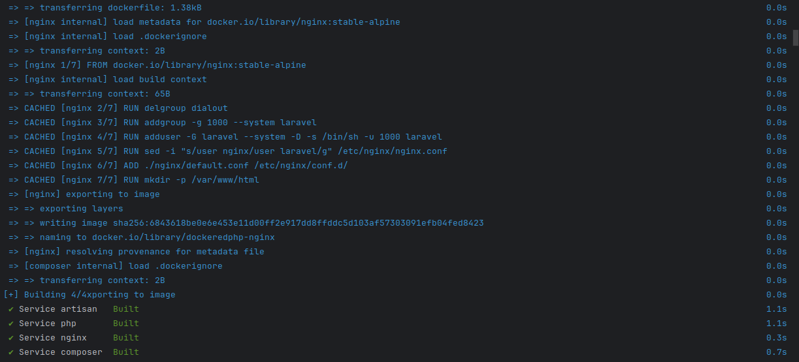
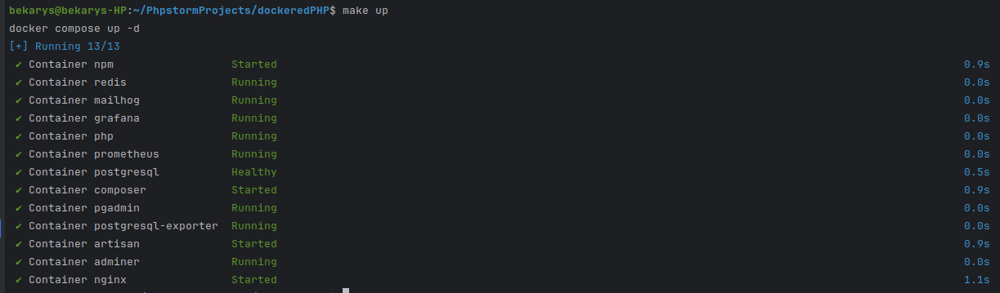
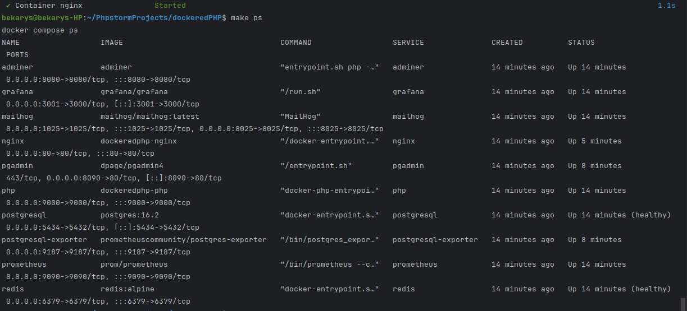
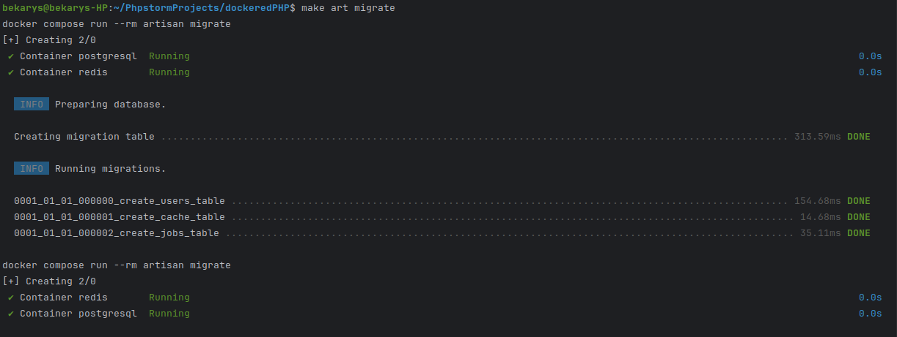

# PhpInfrastructure

## Description
This project is set to create infrastructure to comfortably work with PHP framework laravel, So it contains all development needed services as 
- `nginx` 
- `postgresql`
- `php` 
- `pgadmin`
- `adminer` 
- `redis` 
- `composer` 
- `npm` 
- `artisan` 
- `mailhog` 
- `prometheus` 
- `grafana`

Of course for faster implementation, all services are up by their images mostly from `dockerhub`, additionally have a `docker-compose.yml` that composes and controls all these containers. And to make services easier to control, included `make`.

## Prerequisites
1. `docker`. You can check if it's available by running:
    ```bash
    docker --v
    ```
2. `Docker compose`. Didn't need `docker-compose` because modern versions of docker include docker-compose is now integrated into the docker CLI. You can check if it's available by running:
    ```bash
    docker compose version
    ```
    but if you have old docker version, you need to download `docker-compose`
3. Make.  check if it's available by running:
    ```bash
    make --version
    ```

## Explanation
#### To start infrastructure, we need to clone it first
to clone project, run 
```bash
git clone https://github.com/bekonRymkhanov/PhpInfrastructure.git
cd PhpInfrastructure
```
## Let's dive into the structure of our code
```
PhpInfrastructure/                   # core directory
├── dockerfiles/             
│   ├── nginx                
│   │   └── default.conf             # default.conf file that we will use to set up nginx in cur container
│   ├── prometheus           
│   │   └── prometheus.yml           # prometheus configuration files
│   ├── nginx.dockerfile             # dokcerfile for creation of custom nginx docker image
│   └── php.dockerfile               # dokcerfile for creation of custom php docker image
├── src                              # empty src directory for future main directoy of our project
├── .env                             # file where enviromental variables are stored
├── docker-compose.yml               # main docker-compose.yml used to define and manage multiple Docker containers as a single application using Docker Compose.
├── grfana-dashboard-to-import.yml   # yml of ready grafana dashboards for import
└──Makefile                          # makefile to build automation tool to define and run commands, automate tasks, and manage dependencies in a project.
```
### Dockerfiles
 All the dockerfiles are made by instructions https://habr.com/ru/companies/wunderfund/articles/586778/

#### nginx.dockerfile
```dockerfile
FROM nginx:stable-alpine


ARG UID
ARG GID

ENV UID=${UID}
ENV GID=${GID}

RUN delgroup dialout

RUN addgroup -g ${GID} --system laravel
RUN adduser -G laravel --system -D -s /bin/sh -u ${UID} laravel


RUN sed -i "s/user nginx/user laravel/g" /etc/nginx/nginx.conf

ADD ./nginx/default.conf /etc/nginx/conf.d/

RUN mkdir -p /var/www/html
```
First of all, we pull an alpine image, and then we set user ID and group ID as a non-root user for docker and if you wonder why, because if our container was running as root, and we generated a file from our container through a volume back to our Docker host then the file will be owned by root:root.
By default, UID and GID are 1000 but in a multi-user environment you may end up with something different. After adding user, by using ADD docker command (which exists on the line 16th of nginx.dockerfile):

#### php.dockerfile
```dockerfile
FROM php:8.3-fpm-alpine

ARG UID
ARG GID

ENV UID=${UID}
ENV GID=${GID}

RUN mkdir -p /var/www/html

WORKDIR /var/www/html

COPY --from=composer:latest /usr/bin/composer /usr/local/bin/composer

RUN delgroup dialout

RUN addgroup -g ${GID} --system laravel
RUN adduser -G laravel --system -D -s /bin/sh -u ${UID} laravel

RUN sed -i "s/user = www-data/user = laravel/g" /usr/local/etc/php-fpm.d/www.conf
RUN sed -i "s/group = www-data/group = laravel/g" /usr/local/etc/php-fpm.d/www.conf
RUN echo "php_admin_flag[log_errors] = on" >> /usr/local/etc/php-fpm.d/www.conf

RUN apk add --no-cache \
    curl \
    libxml2-dev \
    php-soap \
    libzip-dev \
    unzip \
    zip \
    libpng \
    libpng-dev \
    jpeg-dev \
    oniguruma-dev \
    curl-dev \
    freetype-dev \
    libpq-dev \
    bash \
    linux-headers \
    postgresql-client

RUN docker-php-ext-install pgsql pdo pdo_pgsql

RUN docker-php-ext-configure gd --enable-gd --with-freetype --with-jpeg \
    && docker-php-ext-install -j$(nproc) gd


RUN mkdir -p /usr/src/php/ext/redis \
    && curl -L https://github.com/phpredis/phpredis/archive/6.0.2.tar.gz | tar xvz -C /usr/src/php/ext/redis --strip 1 \
    && echo 'redis' >> /usr/src/php-available-exts \
    && docker-php-ext-install redis

USER laravel

CMD ["php-fpm", "-y", "/usr/local/etc/php-fpm.conf", "-R"]
```
In This image we used php-8.3 image and same as nginx.dockerfile we give user and group id, but more we installed composer and redis images witch may add weight to our final image,but using php.dockerfile not only for php, aso for composer and redis, it makes less dockerfiles to-do. Finally, we add postgresql pdo to our image.


### nginx
#### default.conf
```apacheconf
server {
    listen 80;
    index index.php index.html;
    server_name localhost;
    root /var/www/html/public;

    location / {
        try_files $uri $uri/ /index.php?$query_string;
    }

    location ~ \.php$ {
        include fastcgi_params;
        fastcgi_pass php:9000;
        fastcgi_index index.php;
        fastcgi_param SCRIPT_FILENAME $document_root$fastcgi_script_name;
        fastcgi_param PATH_INFO $fastcgi_path_info;
    }
}
```
This default.conf file is a Nginx server block configuration for serving a PHP-based web application (e.g., Laravel, WordPress) using FastCGI (PHP-FPM).

### prometheus
#### prometheus.yml
```yaml
global:
  scrape_interval:     15s
  evaluation_interval: 15s

scrape_configs:
  - job_name: prometheus
    static_configs:
      - targets: ['localhost:9090']

  - job_name: postgresql
    static_configs:
      - targets: ['postgresql-exporter:9187']
```
it is the prometheus configuration yaml file that tells Prometheus how often to scrape metrics and which targets (services) to monitor and in witch port to work.

### .env
```dotenv
FORWARD_NGINX_PORT=80
FORWARD_DB_PORT=5434
FORWARD_PHP_PORT=9000
FORWARD_PGADMIN_PORT=8090
FORWARD_ADMINER_PORT=8080
FORWARD_REDIS_PORT=6379
FORWARD_NPM_PORT=3000
FORWARD_MAILHOG_PORT=1025
FORWARD_MAILHOG_DASHBOARD_PORT=8025
PROMETHEUS_PORT=9090
GRAFANA_PORT=3001

UID=1000
GID=1000

DB_DATABASE=laravel_db
DB_USERNAME=bekon
DB_PASSWORD=tokesh58
DB_HOST=postgresql
DB_PORT=5432

GRAFANA_PASSWORD=tokesh58
```
Just an environmental variables for our containers to use, you can change the ports in case of port already been used.Or change database information.

### docker-compose.yml
```yaml  
services:
  nginx:
    container_name: "nginx"
    build:
      context: ./dockerfiles
      dockerfile: nginx.dockerfile
      args:
        - UID=${UID:-1000}
        - GID=${GID:-1000}
    ports:
      - "${FORWARD_NGINX_PORT:-80}:80"
    volumes:
      - ./src:/var/www/html:delegated
      - ./ssl:/etc/ssl
    depends_on:
      - php
      - redis
      - postgresql
    networks:
      - laravel
    restart: unless-stopped

  postgresql:
    image: postgres:16.2
    container_name: postgresql
    environment:
      POSTGRES_DB: ${DB_DATABASE}
      POSTGRES_USER: ${DB_USERNAME}
      POSTGRES_PASSWORD: ${DB_PASSWORD}
      PGDATA: /data/postgres
      TZ: Asia/Almaty
    healthcheck:
      test: [ "CMD-SHELL", "pg_isready -d ${DB_DATABASE} -U ${DB_USERNAME}" ]
      interval: 5s
      timeout: 5s
      retries: 5
    volumes:
      - postgresql:/data/postgres
    ports:
      - "${FORWARD_DB_PORT:-5434}:5432"
    networks:
      - laravel
    restart: unless-stopped

  php:
    container_name: "php"
    build:
      context: ./dockerfiles
      dockerfile: php.dockerfile
      args:
        - UID=${UID:-1000}
        - GID=${GID:-1000}
    ports:
      - "${FORWARD_PHP_PORT:-9000}:9000"
    volumes:
      - ./src:/var/www/html:delegated
      - ./dockerfiles/configs/custom.ini:/usr/local/etc/php/conf.d/custom.ini
    networks:
      - laravel
    restart: unless-stopped

  pgadmin:
    image: dpage/pgadmin4
    container_name: pgadmin
    environment:
      PGADMIN_DEFAULT_EMAIL: bekarys2004r@gmail.com
      PGADMIN_DEFAULT_PASSWORD: beka2004
    volumes:
      - pgadmin:/var/lib/pgadmin
    ports:
      - "${FORWARD_PGADMIN_PORT:-8090}:80"
    depends_on:
      postgresql:
        condition: service_healthy
    networks:
      - laravel
    restart: unless-stopped

  adminer:
    container_name: adminer
    image: adminer
    ports:
      - "${FORWARD_ADMINER_PORT:-8080}:8080"
    environment:
      ADMINER_DEFAULT_DB_DRIVER: pgsql
      ADMINER_DEFAULT_SERVER: postgresql
      ADMINER_DEFAULT_DB_NAME: ${DB_DATABASE}
    depends_on:
      - postgresql
    networks:
      - laravel
    restart: unless-stopped

  redis:
    container_name: "redis"
    image: redis:alpine
    ports:
      - "${FORWARD_REDIS_PORT:-6379}:6379"
    volumes:
      - redis:/data
    healthcheck:
      test: ["CMD", "redis-cli", "ping"]
      retries: 3
      timeout: 5s
    networks:
      - laravel
    restart: unless-stopped

  composer:
    container_name: "composer"
    build:
      context: ./dockerfiles
      dockerfile: php.dockerfile
      args:
        - UID=${UID:-1000}
        - GID=${GID:-1000}
    volumes:
      - ./src:/var/www/html
    depends_on:
      - php
    entrypoint: ["composer"]
    networks:
      - laravel

  npm:
    container_name: "npm"
    image: node:current-alpine
    volumes:
      - ./src:/var/www/html
    ports:
      - "${FORWARD_NPM_PORT:-3000}:3000"
    working_dir: /var/www/html
    entrypoint: ["npm"]
    networks:
      - laravel

  artisan:
    container_name: "artisan"
    build:
      context: ./dockerfiles
      dockerfile: php.dockerfile
      args:
        - UID=${UID:-1000}
        - GID=${GID:-1000}
    volumes:
      - ./src:/var/www/html:delegated
    depends_on:
      - postgresql
      - redis
    entrypoint: ["php", "/var/www/html/artisan"]
    networks:
      - laravel
  mailhog:
    image: mailhog/mailhog:latest
    container_name: mailhog
    ports:
      - '${FORWARD_MAILHOG_PORT:-1025}:1025'
      - '${FORWARD_MAILHOG_DASHBOARD_PORT:-8025}:8025'
    networks:
      - laravel


  prometheus:
    image: prom/prometheus
    container_name: prometheus
    volumes:
      - ./dockerfiles/prometheus/:/etc/prometheus/
      - prometheus:/prometheus
    command:
      - '--config.file=/etc/prometheus/prometheus.yml'
      - '--storage.tsdb.path=/prometheus'
      - '--web.console.libraries=/usr/share/prometheus/console_libraries'
      - '--web.console.templates=/usr/share/prometheus/consoles'
    ports:
      - "${PROMETHEUS_PORT:-9090}:9090"
    restart: unless-stopped
    networks:
      - laravel


  postgresql-exporter:
    image: prometheuscommunity/postgres-exporter
    container_name: postgresql-exporter
    ports:
      - "9187:9187"
    environment:
      DATA_SOURCE_NAME: "postgres://${DB_USERNAME}:${DB_PASSWORD}@${DB_HOST}/${DB_DATABASE}?sslmode=disable"
    depends_on:
      prometheus:
        condition: service_started
      postgresql:
        condition: service_healthy
    restart: unless-stopped
    networks:
      - laravel


  grafana:
    image: grafana/grafana
    container_name: grafana
    environment:
      GF_SECURITY_ADMIN_PASSWORD: ${GRAFANA_PASSWORD}
      GF_USERS_ALLOW_SIGN_UP: false
    volumes:
      - grafana:/var/lib/grafana
    ports:
      - "${GRAFANA_PORT:-3000}:3000"
    restart: unless-stopped
    networks:
      - laravel


volumes:
  postgresql:
    driver: local
  pgadmin:
    driver: local
  redis:
    driver: local
  prometheus:
  grafana:
  postgresql-exporter:

networks:
  laravel:
    driver: bridge
```
all the docker-compose.yml file was writen by instructions from https://devops.org.ru/dockercompose-summary and https://youtu.be/5bSA__OWebM?si=wqeqsoHF3xKzR5zc

all the containers will be up by ports that we writed in .env file and all containers have the same network `laravel` that gives opportunity to connect with each other.

### Makefile
used Makefile to easly manage containers and commands, type:
```bash
make help
```
to see all posible commands of make


## Usage
1. first we need to build our containers. Run
   ```bash
   make build
   ```
   ### expected result
      i have build my images before so it just uses cached ones,but your build might be longer.
      

2. then we need to up our containers by running:
   ```bash
   make up
   ```
   ### expected result
   
3. check for services available.
   ```bash
   make ps
   ```
   ### expected result
   
4. next we need to create laravel project inside our container
   ```bash
   make composer create-project laravel/laravel .
   ```
   ### expected result
   
5. next we need to change .env variables of our laravel project.
   ```bash
   cd src
   nano .env
   ```
   and in nano editor uncomment database variables and change them to
   ```.dotenv
   DB_CONNECTION=pgsql
   DB_HOST=postgresql #all containers are in same network so they will see each other
   DB_PORT=5432
   DB_DATABASE=laravel_db
   DB_USERNAME=bekon
   DB_PASSWORD=tokesh58
   ```
   if you need redis or mail mailer to be connected, you need to change varues in this file
   
   then dont forget to migrate again, because database changed.
   ```bash
   make art migrate
   ```
   ### expected result
   
### Check
now check for site being available by http://localhost

additionaly you can check other services,like 
- adminer-http://localhost:8080,
- pgadmin-http://localhost:8090,
- prometheus pgexporter-http://localhost:9187
- prometheus-http://localhost:9090
- grafana-http://localhost:3001
- mailhog-http://localhost:8025

## if you have a questions about containers please contact 
- tg => @illegalunicorn
- mail => b_rymkhanov@kbtu.kz
