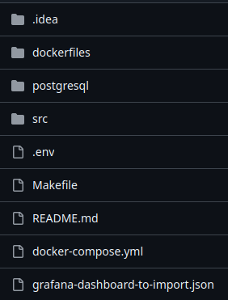

# PhpInfrastructure

## Description
This project is set to create infrastructure to comfortably work with PHP framework laravel, So it contains all development needed services as 
- `nginx` 
- `postgresql`
- `php` 
- `pgadmin`
- `adminer` 
- `redis` 
- `composer` 
- `npm` 
- `artisan` 
- `mailhog` 
- `prometheus` 
- `grafana`

Of course for faster implementation, all services are up by their images mostly from `dockerhub`, additionally have a `docker-compose.yml` that composes and controls all these containers. And to make services easier to control, included `make`.

## Prerequisites
1. `docker`. You can check if it's available by running:
```bash
docker --v
```
2. `Docker compose`. Didn't need `docker-compose` because modern versions of docker include docker-compose is now integrated into the docker CLI. You can check if it's available by running:
```bash
docker compose version
```
but if you have old docker version, you need to download `docker-compose`
3. Make.  check if it's available by running:
```bash
make --version
```

## Explanation
#### To start infrastructure, we need to clone it first
to clone project, run 
```bash
git clone https://github.com/bekonRymkhanov/PhpInfrastructure.git
cd PhpInfrastructure
```
### Let's dive into the structure of our code



